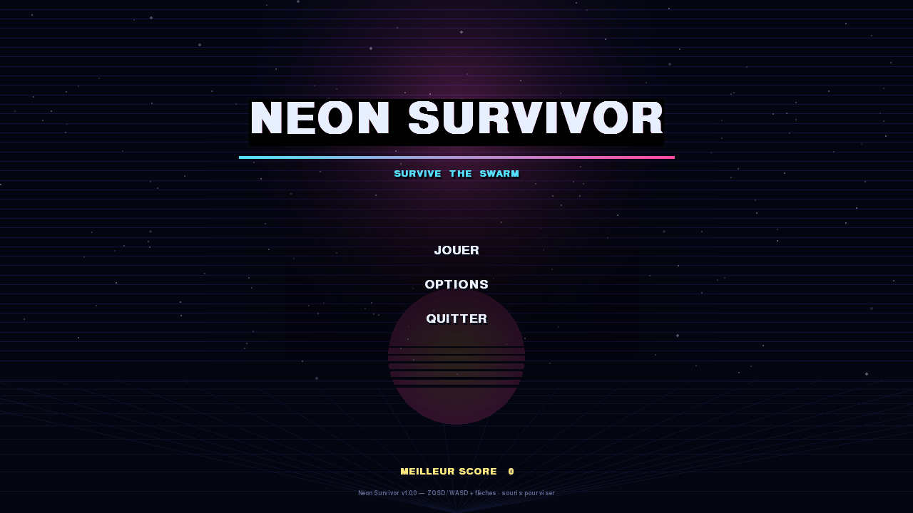
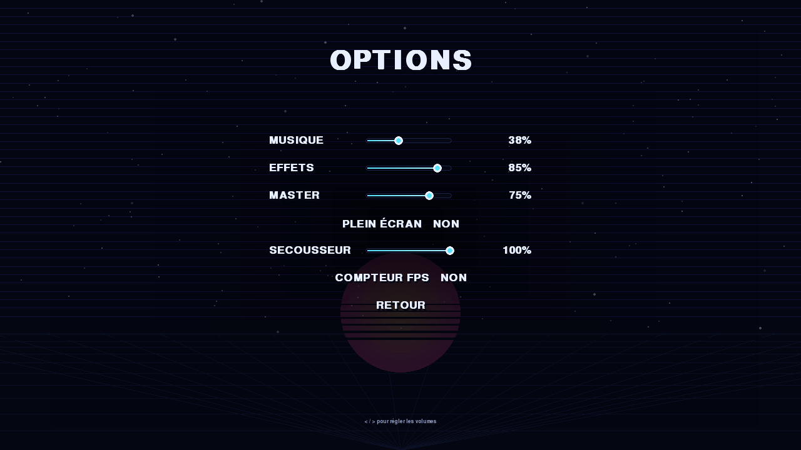
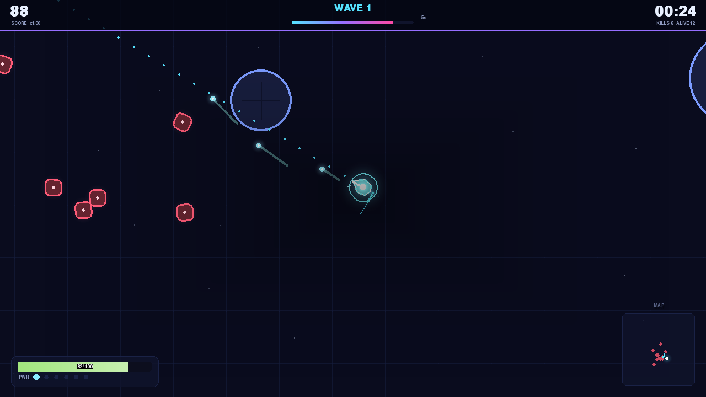

# Neon Survivor

> A neon-drenched 2D top-down action/survival game written in Python with
> [pygame-ce](https://github.com/pygame-community/pygame-ce).
> **Every sprite, particle, sound effect and music track is generated by code**
> — the repository contains no third-party media asset.

Survive as long as you can against an endless horde, collect bonuses, and beat
your best score. It runs on Windows, Linux and macOS, and ships as a single
self-contained `.exe` built by GitHub Actions.



---

## Table of contents

- [Features](#features)
- [Screenshots](#screenshots)
- [Getting the Windows executable](#getting-the-windows-executable)
- [Playing](#playing)
- [Controls](#controls)
- [Enemies](#enemies)
- [Pickups](#pickups)
- [Running from source](#running-from-source)
- [Running the tests](#running-the-tests)
- [Building the executable yourself](#building-the-executable-yourself)
- [Project layout](#project-layout)
- [Configuration](#configuration)
- [Licence](#licence)

---

## Features

- **Top-down twin-stick action** — ZQSD *and* the arrow keys move, the mouse
  aims, the left button (or hold) fires.
- **Eight enemy archetypes** with genuinely different AI, not reskins.
- **Endless escalating difficulty**: spawn rate, enemy speed, HP, damage and
  the number of simultaneous enemies all scale with the wave number, and a
  **boss** appears every fifth wave.
- **Seven collectible bonuses** — health, weapon power, speed, shield, nuke,
  magnet and score gems.
- **Combo scoring** with a decaying multiplier, plus a survival bonus paid
  out when you die.
- **Persistent best score / best wave / best time / total kills**, written
  atomically to a per-user profile that survives a read-only install folder.
- **Full menu flow** — title screen, options, pause, game over with instant
  restart, all keyboard *and* mouse driven.
- **Procedural graphics**: animated glowing shapes, particles, shockwaves,
  screen shake, vignette, scanlines, a live minimap and a laser aim guide.
- **Procedural audio**: 20 synthesised sound effects and three seamless
  looping music tracks (menu / action / boss), rendered in pure Python.
- **Fully headless-safe**: no display or sound card is required — the game
  degrades to silence instead of crashing, which is what makes the CI
  pipeline possible.
- **60 FPS with a hard entity cap** — 20 000 simulated frames stay around
  30 MB of RAM and well under a millisecond of update time per frame.

## Screenshots

| Title | Options | In game |
| --- | --- | --- |
|  |  |  |

## Getting the Windows executable

1. Open the **Actions** tab of the repository.
2. Pick the **Build Windows executable** run you want.
3. At the bottom of the run page, download the artifact
   **`NeonSurvivor-Windows-x64`**.

The artifact contains:

```
NeonSurvivor.exe              # the game, nothing else required
NeonSurvivor-Windows-x64.zip  # the same exe + LICENSE + README
sha256.txt                    # checksum of the exe
```

Double-click `NeonSurvivor.exe` to play. There is no installer and no
runtime dependency — the interpreter, SDL2 and pygame-ce are all bundled
inside. A GitHub **Release** is also created automatically for every `v*` tag,
with the executable attached directly to it.

> Windows SmartScreen shows *“Windows protected your PC”* on unsigned
> executables. Click **More info → Run anyway**.

## Playing

You are the cyan arrow. Enemies spawn just outside the edge of your view and
close in. The arena is a fixed 4800 × 4800 grid dotted with solid pillars you
can hide behind — and can also get cornered against, so keep moving.

- Kills give points. Killing enemies quickly chains a **combo** multiplier up
  to ×4; the bar under your health drains and resets it.
- The **wave** number climbs with time. Every wave spawns tougher and more
  numerous enemies; every fifth wave is a boss wave.
- The **nuke** pickup is a screen-wide expanding shockwave that erases almost
  everything on the field — use it when you are surrounded.
- When your health reaches zero the run ends, your survival bonus is added,
  and the game-over screen shows your score against your best.

## Controls

| Action | Keys |
| --- | --- |
| Move | `Z Q S D` **or** `↑ ← ↓ →` |
| Aim | Mouse |
| Fire | Left mouse button (hold for continuous fire) |
| Pause / resume | `Esc` or `P` |
| Mute / unmute | `M` |
| Fullscreen | `F11` or `Alt` + `Enter` |
| FPS counter | `Ctrl` + `F3` |
| Menu navigation | `↑ ↓` / `W` `S` or the mouse |
| Validate a menu entry | `Enter`, `Space` or click |

## Enemies

| Name | Behaviour |
| --- | --- |
| **Grunt** | The baseline: walks straight at you, slow and fragile. |
| **Runner** | Fast and evasive; circles before charging in. |
| **Shooter** | Keeps its distance and fires slow homing bolts. |
| **Tank** | Very slow, very high HP, heavy contact damage. |
| **Charger** | Winds up, dashes in a straight line, then recovers. Dashing hurts more. |
| **Splitter** | Dies into two smaller, faster halves (depth-limited recursion). |
| **Weaver** | Strafes in a wide sine pattern, hard to hit. |
| **Boss** | Every fifth wave. Large, armoured, spawns adds when damaged. |

## Pickups

| Icon | Name | Effect |
| --- | --- | --- |
| ❤ | Health | Restores HP. |
| ✦ | Power | Faster bullets, more damage, extra projectiles. |
| » | Speed | Permanent movement-speed increase. |
| ◈ | Shield | Absorbs the next hits before your health does. |
| ✹ | Nuke | Expanding shockwave that clears the arena. |
| ◎ | Magnet | Pulls nearby pickups to you. |
| ◆ | Score gem | Instant points. |

## Running from source

Requires **Python 3.10+**.

```bash
git clone https://github.com/Nabz83/lmarena.git
cd lmarena

python -m venv .venv
# Windows
.venv\Scripts\activate
# Linux / macOS
source .venv/bin/activate

pip install -r requirements.txt

python -m neon_survivor
```

Command line options:

```bash
python -m neon_survivor --fullscreen      # start fullscreen
python -m neon_survivor --windowed        # force a window
python -m neon_survivor --fps             # show the frame counter
python -m neon_survivor --no-sound        # disable all audio
python -m neon_survivor --frames 300      # quit after 300 frames (smoke test)
python -m neon_survivor --version
```

## Running the tests

```bash
pip install -r requirements-dev.txt
python -m pytest tests -q
```

The suite runs completely headless (SDL's dummy video and audio drivers), so
it works on CI without a display or a sound card.

## Building the executable yourself

The Windows build is a one-file PyInstaller bundle driven by
[`NeonSurvivor.spec`](NeonSurvivor.spec):

```powershell
pip install -r requirements-dev.txt
python tools\make_icon.py            # generates build_assets\icon.ico from code
python -m PyInstaller NeonSurvivor.spec --noconfirm --clean
```

The executable is written to `dist\NeonSurvivor.exe`.

The whole pipeline is automated in
[`.github/workflows/build-windows.yml`](.github/workflows/build-windows.yml):
checkout → install → **run the tests** → generate the icon → build → smoke-test
(`--frames 120`) → upload the artifact.

You can also trigger it by hand from the Actions tab
(*Build Windows executable → Run workflow*), or from the command line:

```bash
gh workflow run build-windows.yml
```

## Project layout

```
neon_survivor/
├── config.py        # every tunable constant (no pygame import, test friendly)
├── settings.py      # persistent profile: best score, volumes, atomic save
├── app.py           # window, scene switching, main loop
├── main.py          # launcher used by PyInstaller
├── __main__.py      # `python -m neon_survivor` entry point + CLI flags
├── core/            # display independent systems
│   ├── mathutils.py     # vectors, clamping, angle helpers
│   ├── collision.py     # circle/circle, circle/rect, line of sight
│   ├── world.py         # arena, pillars, static broad-phase grid
│   ├── camera.py        # follow, clamping, trauma shake
│   ├── difficulty.py    # wave curve and spawn budget
│   ├── spawner.py       # where and what to spawn
│   ├── particles.py     # bounded particle pool
│   └── score.py         # score, combo, statistics
├── entities/
│   ├── player.py        # movement, weapon, health, upgrades
│   ├── enemy.py         # shared enemy behaviour + per-type AI
│   ├── enemy_types.py   # the eight archetypes
│   ├── projectiles.py   # player and hostile bullets
│   └── pickups.py       # the seven bonuses
├── gfx/             # procedural rendering (shapes, glow, particles, fonts)
├── audio/           # pure-Python synth, 20 SFX, 3 music tracks, mixer manager
├── ui/              # theme, widgets, HUD, title/options/pause/game-over screens
└── game.py          # the GameScene: ties every system together
tests/               # 310 headless tests
tools/make_icon.py   # draws and packs the .ico used by the build
```

## Configuration

Gameplay values live in [`neon_survivor/config.py`](neon_survivor/config.py) and
are plain module constants — no JSON, no runtime parser:

| Constant | Meaning |
| --- | --- |
| `WINDOW_WIDTH` / `WINDOW_HEIGHT` | Default window size |
| `TARGET_FPS` | Frame cap (60) |
| `WORLD_WIDTH` / `WORLD_HEIGHT` | Arena size (4800 × 4800) |
| `PLAYER_SPEED` / `PLAYER_MAX_HEALTH` | Player stats |
| `ENEMY_HARD_CAP` | Absolute limit on simultaneous enemies |
| `NUKE_WAVE_SPEED` | Speed of the nuke shockwave |

Options (volumes, fullscreen, screen shake, FPS counter) are changed in-game
on the **Options** screen and persisted to `%APPDATA%\neon_survivor\`.

## Licence

The game is **MIT** licensed — see [`LICENSE`](LICENSE).

Every dependency has a permissive licence, and **no media asset is
redistributed**: all visuals and sounds are generated at runtime.
The exact details of each bundled library are in
[`LICENSE-NOTES.md`](LICENSE-NOTES.md).
